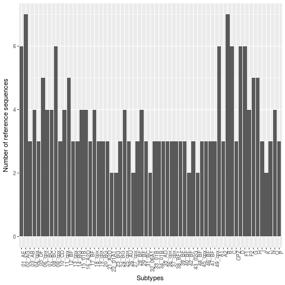

  
## Alignment-free subtyping of  HIV sequences
  
**Mukarram Hossain**
  
Department of Veterinary Medicine  
University of Cambridge
  
MEPI group meeting, March 2017 
  
&nbsp;

---
  
### Subtype classification
  
- Viruses are often grouped into subtypes.
- Subtypes have wide implications on the following studies of viruses:
    - clinical
    - epidemiological
    - structural
    - functional
- Existing classification techniques mostly rely on alignments followed by phylogenetic and/or statistical algorithms.

---

### Alignment uncertainty

&nbsp;

---

### Alignment-free classification

- Lossless compression techniques have shown promising results for biological sequence classification:
  - Protein family prediction (Begleiter et al., 2004)
  - Protein structure prediction (Ferragina et al., 2007)

---
  
  
&nbsp;

---
  
### COMET 
  
- COMET is an ultrafast alignment free subtyping tool
- Uses **P**rediction by **P**artial **M**atching (PPM)
- Initially designed for HIV-1
- COMET was tested on both synthetic (1090698) and clinical (10625) HIV datasets
- Sensitivity and specificity were comparable to or higher than:
    - REGA (de Oliveira *et al.*, 2005) and 
    - SCUEAL (Pond *et al.*, 2009)
- Detected and identified new recombinant forms

---

### COMET algorithm

- Builds variable-order Markov models for each reference sequence
- Given a query, COMET calculates log likelihood of observing a base at each positions
- This results in a matrix of likelihood values
- Subtype call is done using a decision tree

---

### The decision tree

&nbsp;

---

### Lossless compression using ANN

- Schmidhuber and Heil (1996) presented 'Sequential neural text compression'   
- Can have similar performance as PPM (MV Mahoney, 2000)
- The predictor network upon seeing a stream of input characters:
    - assigns probability distribution for the next character
- Probabilities can be used in the same way COMET likelihoods work

---

### Classification using Neural Networks

- *Neural networks* are computational system mimicking biological brain
- Consists of a cluster of neural units organised in layers
- All the neural units between layers are fully connected with weights attached 
- Each neuron has activation function and a bias associated with them  

---

&nbsp;

---

### ANN: design

- The input layer consists of 32 neurons getting values from the context
- Each nucleotide is represented by a one-hot vector
    - A is [1,0,0,0]  while T is [0,0,0,1]
- Hidden layer consists of **N** neurons
    - processes inputs coming from the input layer using wights and biases
- Output layer consists of 4 neurons
    - uses *softmax funnction* to generate probabilities for the Nucleotide bases A, C, G, T 

---

### ANN : implementation

- Based on the example code from the book 'Neural networks and deep learning' by Michael Nielsen
- Written in Python3 

---

### ANN: training

- We use the reference sequence set used in **COMET** to train the ANN
- Cross-validation is done using randomly removing one sequence from the training set for each subset
- Cross-entropy cost function is used to update network weights and biases
- Multiple epochs are used and the one producing best validation accuracy is stored

---

### ANN: subtyping

- For each nucleotide positions in the query sequence: 
    - ANNs from each subtype generates probabilities of seeing the nucleotide given previous context
- The decision tree used in COMET is used to predict the subtype of the query sequence

---

### Reference dataset

&nbsp;

---

### Cross-validation

&nbsp;

---

### Test datasets

- Reference (215 sequences)
- Vanderbilt (2779 sequences)
- PR-RT (727 sequences)

---

### Accuracy comparison

&nbsp;

---

### Future direction

- Optimise neural network parameters
- Use *`tanh`* function?
- Larger context size?
- Recurrent Neural Networks (RNN)?
- Report breakpoints for potential novel recombinants 
- Implement using TensorFlow 

---

### Acknowledgements

- Simon Frost
- Richard Dybowski

---

  

  
